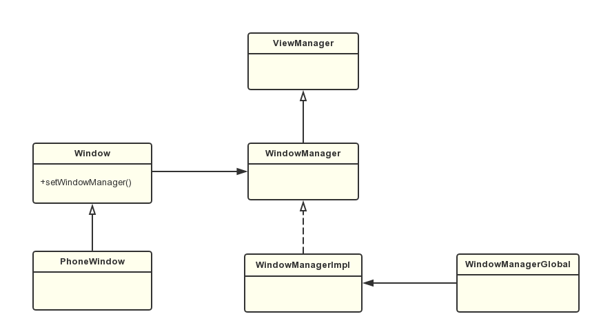
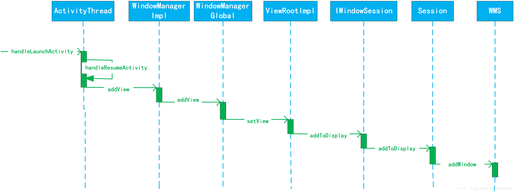
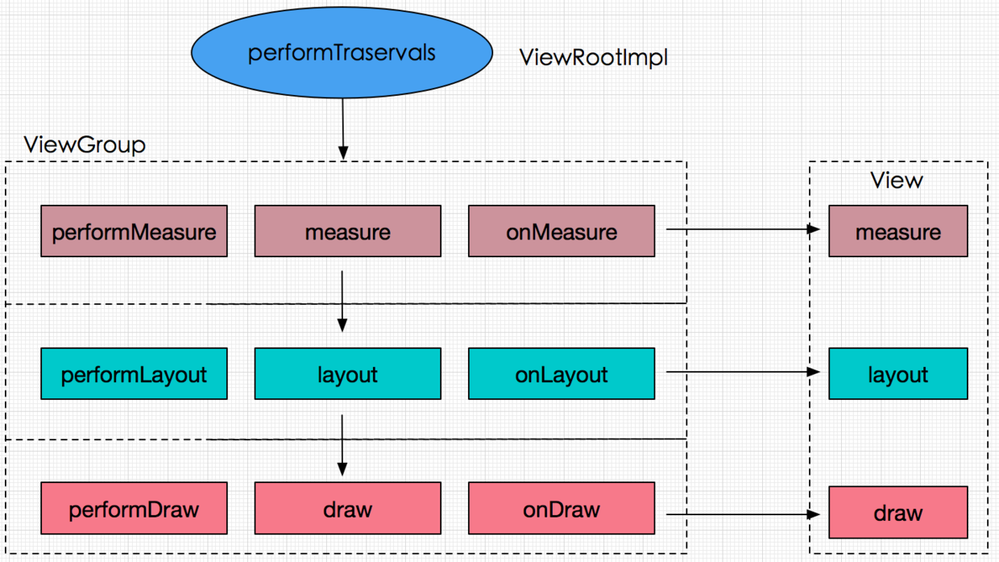

# eis-abok
<!-- vscode-markdown-toc -->
- [eis-abok](#eis-abok)
- [Framework](#framework)
  - [Android系统架构](#android系统架构)
  - [Zygote进程](#zygote进程)
  - [SystemServer进程](#systemserver进程)
  - [Launcher的启动过程](#launcher的启动过程)
  - [应用程序启动流程](#应用程序启动流程)
  - [Binder](#binder)
  - [WindowManager](#windowmanager)
  - [Activity](#activity)
  - [Service](#service)
  - [BroadcastReceiver](#broadcastreceiver)
  - [ContentProvider](#contentprovider)
  - [异步任务和消息机制](#异步任务和消息机制)
- [UI](#ui)
  - [View的添加流程](#view的添加流程)
  - [View的事件传递机制](#view的事件传递机制)
  - [常用组件：RecyclerView](#常用组件recyclerview)
  - [ViewBinding](#viewbinding)
  - [Fragment](#fragment)
- [常用组件:](#常用组件)
- [Java基础](#java基础)
- [算法、数据结构、网络基础](#算法数据结构网络基础)
- [第三方库](#第三方库)
- [jetpack](#jetpack)
- [kotlin](#kotlin)

<!-- vscode-markdown-toc-config
	numbering=false
	autoSave=true
	/vscode-markdown-toc-config -->
<!-- /vscode-markdown-toc -->
# Framework

## Android系统架构
Android是一种基于Linux的开放源代码软件栈，为各类设备和机型而创建。下图为Android平台的主要组件。参考<https://developer.android.google.cn/guide/platform>。

- Linux内核
Android平台的基础是Linux内核。例如Android Runtime（ART）以Linux内核来执行底层功能，例如线程和底层内存管理。
- 硬件抽象层(HAL，Hardware Abstraction Layer)
  HAL提供标准界面，向更高级别的Java API框架显示设备硬件功能。HAL包含多个库模块，其中每个模块都为特定类型的硬件组件实现一个界面，例如相机或蓝牙模块。当框架API要求访问设备硬件时，Android系统将为该硬件组件加载库模块。
- Android Runtime
  ART是Android上的应用和部分系统服务使用的托管运行时。对于运行Android 5.0（API 21）或更高版本的设备，每个应用都在自己的进程中运行，并且有其自己的Android Runtime（ART）实例。ART和Dalvik的关系参考：<https://source.android.google.cn/docs/core/runtime>
- 原生C/C++库
  许多核心Android系统组件和服务（例如ART和HAL）构建自原生代码，需要以C和C++编写原生库。
- Java API框架
  包括视图系统、资源管理器、通知管理器、Activity管理器、内容提供程序。
- 系统应用

## Zygote进程
Android系统的Zygote进程是所有Android进程的父进程，包括SystemServer和各种应用进程都是通过Zygote进程fork出来的。Zygote进程则是通过Linux系统的init进程启动的。
Zygote进程共做了如下几件事：
1、开启DDMS(Dalvik Debug Monitor Service)。
2、创建服务端Socket。
3、预加载class、resource、OpenGL、WebView等资源。
4、fork并启动SystemServer。
5、调用runSelectLoop()一直监听Socket信息。
6、fork并启动应用进程(AMS通过Socket向Zygote进程发送了一个创建应用进程的请求)。

- 为什么SystemServer进程与Zygote进程通讯采用Socket而不是Binder？
  多线程程序里不准使用fork，fork出来的子进程可能会死锁。
  参考：https://blog.csdn.net/qq_39037047/article/details/88066589

源码参考：<http://androidxref.com/9.0.0_r3/xref/frameworks/base/core/java/com/android/internal/os/ZygoteInit.java>

## SystemServer进程
Zygote进程会启动SystemServer进程，并调用SystemServer的main方法（参考ZygoteInit.java、RuntimeInit.java）。
SystemServer在启动时做了如下工作：
1、启动Binder线程池，这样就可以与其他进程进行通信。（在ZygoteInit.zygoteInit()中通过JNI调用，函数位于AndroidRuntime.cpp,实现在app_process.cpp），参考:
<http://androidxref.com/9.0.0_r3/xref/frameworks/base/core/jni/AndroidRuntime.cpp>
<http://androidxref.com/9.0.0_r3/xref/frameworks/base/cmds/app_process/app_main.cpp>
2、创建SystemServiceManager用于对系统的服务进行创建、启动和生命周期管理。
3、启动各种系统服务。
源码参考：<http://androidxref.com/9.0.0_r3/xref/frameworks/base/services/java/com/android/server/SystemServer.java>

## Launcher的启动过程
Android系统默认第一个启动的应用程序是Home应用程序，这个Home应用程序就叫做Launcher。在SystemServer中的`startOtherService`中ActivityManagerService的systemReady方法中会启动Launcher程序。
在SystemServer中会启动PackageManagerService服务，这个服务会解析应用程序文件，并从里面得到应用程序的相关信息。Launcher会从PackageManagerService服务总把这些安装好的应用取出来，并呈现在桌面上。
源码参考：<http://androidxref.com/9.0.0_r3/xref/frameworks/base/services/core/java/com/android/server/am/ActivityManagerService.java>

## 应用程序启动流程
1、Launcher通过Binder机制通知AMS启动一个Activity
2、AMS使Launcher栈最顶端的Activity进入onPause状态
3、AMS通知Process使用Socket和Zygote进程通信，请求创建一个新进程
4、Zygote收到Socket请求，fork出一个进程，并调用ActivityThread#main()
5、ActivityThread通过Binder通知AMS启动应用程序
6、AMS通知ActivityStackSupervisor真正的启动Activity
7、ActivityStackSupervisor通知ApplicationThread(通过Binder实现)启动Activity
8、ApplicationThread发送消息给ActivityThread，需要启动一个Activity
9、ActivityThread收到消息之后，通知LoadedApk创建Application，并调用其onCreate方法
10、ActivityThread装载目标Activity类，并调用Activity#attach()
11、ActivityThread通知Instrumentation调用Activity#onCreate()
12、Instrumentation调用Activity#performCreate(),在Activity#performCreate中调用自身onCreate方法

中间涉及到的进程通信：1、3、5、7

相关类说明：
ActivityManagerService 负责管理系统中所有 Activity 的生命周期  
ActivityThread // 主线程、开启消息队列循环，与 ams 配合完成 Activity 的管理工作  
ApplicationThread 通过Binder实现 ams 和 ActivityThread 的交互  
Instrumentation，应用进程的管家，每个应用程序只有一个该对象，每个 Activity 持有该引用，ActivityThread 要创建或者暂停 Activity 是要通过 Instrumentation 来进行具体操作。
ActivityStack，Activity 在 ams 的栈管理  
ActivityRecord，ActivityStack 的管理对象，每个 Activity 在 ams 对应一个 ActivityRecord  
TaskRecord，ams 抽象出的一个“任务”概念，记录 ActivityRecord 的栈，一个 Task 包含若干个 ActivityRecord，ams 用 TaskRecord 确保 Activity 启动和退出顺序

## Binder

- Android 中进程和线程的关系  
  1、进程是系统进行资源分配和调度的一个独立单位，也就是说进程是可以独立运行的一段程序。  
  2、线程是进程的一个实体，是 CPU 调度和分派的基本单位，他是比进程更小的能独立运行的基本单位，线程基本上不拥有系统资源。在运行时，知识暂用一些计数器、寄存器和栈。
  3、进程有不同的代码和数据空间，而多个线程则共享数据空间。

- 为何需要进行 IPC,多进程通信可能会出现什么问题？
  为什么要用多进程：  
   1、虚拟机给每一个进程分配的内存是有限制的，LMK（low meminfo killer）会优先回收对系统资源占用多的进程。  
   2、为了突破内存限制，防止占用内存过多被杀。  
   3、功能稳定性，一个进程崩溃对另外进程不造成影响：将不稳定功能放入独立进程。  
   4、规避内存泄漏，独立的 WebView 进程阻止内存泄漏导致问题。 //TODO webView 跨进程注意事项 
   https://blog.csdn.net/jack123lian/article/details/121649185  
  可能出现的问题：  
   1、静态成员和单例模式失效。  
   2、线程同步机制失效。  
   3、SharedPreferences 可靠性降低。  
   4、Application 被多次创建。  
   对于前两个问题，可以这么理解，在 Android 中系统会为每个应用或进程分配独立的虚拟机，不同的虚拟机自然占有不同的内存地址空间，所以同一个类的对象会产生不同的副本，导致共享数据失败，必然也不能实现线程同步。  
   第三点因为在内存中会有一份 SharedPreferences 文件的缓存，在多进程模式下，他的读/写就变得不可靠，当面对高并发的读写访问，SharedPreferences 有很大几率会丢失数据。  
   第四点和前两个问题类似，系统在分配多个虚拟机时相当于把同一个应用重新启动多次，必然会导致 Application 多次被创建，为了防止在 Application 中出现无用的重复初始化，可以使用进程名字来做过滤，只让指定进程做初始化操作。

  为了保证进程空间不被其他进程破坏或干扰，Linux 中的进程是相互独立或相互隔离的，在 Android 系统中一个应用程序默认只有一个进程，每个进程都有自己独立的资源和内存空间，其他进程不能任意访问当前进程的内存和资源，这样导致在不同的进程的四大组件没法进行通信，线程间没法做同步，静态变量和单例也会失效。所以需要一套 IPC 机制来解决进程间通信、数据传输的问题。

- Android 中 IPC 方式有几种、各种方式优缺点？  
  //TODO 详细了解各个方式的使用方法https://blog.csdn.net/zeng622peng/article/details/62881834?locationNum=3&fps=  
   1、Intent  
   2、文件共享  
   3、AIDL  
   4、Messenger  
   5、ContentProvider  
   6、RemoteViews  
   7、Socket  
   8、Binder
- 为何新增 Binder 来作为主要的 IPC 方式？  
  1、效率：只需要一次内存拷贝，数据从发送方的用户空间拷贝到内核的缓存区，而接收方的缓存区与内核的缓存区是映射到同一块物理地址的；Binder 性能仅次于共享内存。
  2、稳定性：共享内存容易出现死锁和资源竞争，稳定性较差。Binder 基于 C/S 架构，Server 端与 Client 端相对独立，稳定性较好。  
  3、安全性：传统 Linux IPC 的接收方无法获得对方进程可靠的 UID/PID,从而无法鉴别对方身份，而 Binder 机制为每个进程分配了 UID/PID，且在 Binder 通信时会根据 UID/PID 进行有效性检测。
  Binder 通信采用 C/S 架构，从组件视角来说，包含 Client、Server、ServerManager 以及 Binder 驱动，其中 ServiceManager 用于管理系统中的各种服务。
- 其他：参考 https://blog.csdn.net/ly0724ok/article/details/117566381/
  1、mmap()通常是用在有物理介质的文件系统上，进程中的用户区域时不能直接和物理设备打交道的。  
  2、不同的虚拟内存指向相同的物理内存，从而实现共享内存和共享文件。  
  3、L0 寄存器、L1 是指令 cache 和数据 cache、L2 是单核总 cache、L3 是所有核总 cache、L4 是内存、L5 是硬盘、磁盘、L6 是通过网络挂载的远程文件系统。  
  4、lkm(Loadable Kernel Module)、ioctl(input/output control)。
  5、Intent 传输数据的大小受 Binder 的限制，上限是 1M。

  - 什么是 AIDL(Android Interface Define Language)
    从某种意义上说 AIDL 其实是一个模板，因为在使用过程中，实际起作用的并不是 AIDL 文件，而是据此而生成的一个 IInterface 的实例代码，AIDL 其实是避免我们重复编写代码而出现的一个模板。  
    AIDL 参数支持八种基本数据类型：byte、char、short、int、long、float、double、boolean。  
    AIDL 生成类的细节：
    1、生成一个继承`IInterface`的接口。  
    2、其中有 2 个静态内部类`Stub`和`Proxy`。  
    3、`Stub`是一个抽象类，继承了`Binder`，重写了 Binder 的`onTransact`方法。在 Service 的 onBind 方法中返回这个类的实现对象,也就是一个 Binder 对象。
    4、客户端 ServiceConnection 的 onServiceConnected 的参数中有一个 Ibinder 对象，也就是 Servicer 中的 Binder 对象。这个对象转换为`Proxy`代理对象，通过这个代理对象来调用 AIDL 文件中定义的接口。代理对象重写的接口方法中，通过调用 Binder 的`transact`方法来实现通信。
  - MMAP 的原理讲解 //TODO Linux 相关知识

    系统服务与 bindService 启动的服务的区别
    Activity 的 bindService 流程
    四大组件底层的通信机制
    Binder 机制是如何跨进程的？
## WindowManager
- Window是一个抽象类，具体的实现类为PhoneWindow，它是对View进行管理的。
- WindowManager是一个接口类，继承自父接口ViewManager，它是用来管理Window的，它的具体实现类为WindowManagerImpl。
- WMS是WindowManager进行窗口管理的具体实施者，如果我们想要对Window进行添加和删除就可以使用WindowManager，具体的工作是由WMS来处理的，WindowManager和WMS通过Binder来进行跨进程通信。
- Window分为三大类：应用程序类型、子窗口（例如PopupWindow）、系统窗口（Toast、输入法窗口、系统音量条等）
- Activity启动时会调用到Activity#attach()方法，这里初始化了Window。Window中添加View是在WindowManagerGlobal中实现的，在其中初始化了ViewRootImpl。

Window和WindowManager的关系如下图：
Window添加View流程图：

参考：<https://blog.csdn.net/huaxun66/article/details/78354893>
源码参考：<http://androidxref.com/9.0.0_r3/xref/frameworks/base/core/java/android/view/>


## Activity

- Activity 的生命周期可以从三种状态来说明：  
  1、激活态：当 Activity 位于屏幕前端，并可以获得用户焦点、接收用户输入。  
  2、暂停态：当 Activity 运行时被另一个 Activity 遮挡并获取焦点，此时 Activity 仍然可见，也就是说另一个 Activity 是部分遮挡的，或者另一个 Activity 是透明或者半透明的，此时 Activity 处于暂停状态。  
  3、停止态：当 Activity 被另一个 Activity 完全遮挡不可见时处于停止状态，这个 Activity 仍然存在，它保留在内存中并保持所有状态和成员信息，但是当系统内存不足时，这个 Activity 可能被系统杀掉以释放其占用的内存空间，当再次打开改 Activity 时，它会被重新创建。

  ```
    onCreate
    onRestart：在停止态，又被重新打开时调用
    onStart 可见不可点击
    onResume 可见可点击
    onPause：暂停态, 可见不可点击,做数据持久化在onPause中，不要在onStop，选择onPause()**最早**保存持久数据是最安全的
    onStop：停止态, 不可见
    onDestroy：销毁
  ```

  几种 Activity 生命周期变换的场景  
  横竖屏切换：onPause->onStop->onDestroy->onCreate->onStart->onResume  
  按 home 键：onPause->onStop  
  按返回键：onPause->onStop->onDestroy  
  锁屏与解锁屏幕：onPause->onStop,onRestart->onStart->onResume  
  跳转透明 Activity 界面：onPause  
  启动一个 Theme 为 Dialog 的 Activity：onPause  
  弹出 Dialog 时 Activity 的生命周期：没有变化

- `onSaveInstanceState`、`onRestoreInstanceState` 的调用时机
  调用链说明：  
  1、 在`ActivityThread`中，在 Android3.0 之前在`performPauseActivity`方法中有调用`callActivityOnSaveInstanceState`方法。  
  2、在`callActivityOnStop`方法中， Android P(9.0)之前会先调用`callActivityOnSaveInstanceState`，再调用 Activity 的`performStop`方法。  
  3、在 9.0 之后时调用 Activity 的`performStop`方法之后在调用`callActivityOnSaveInstanceState`。

  4、`callActivityOnStop`在`ActivityThread`中有多处调用，onSaveInstanceState 的触发条件包括一下几中：

  - 当按下 HOME 键时
  - 长按 HOME 键，选择运行程序时
  - 按下电源（关闭屏幕显示）时
  - 从 Activity 中启动其他 Activity 时
  - 屏幕方向切换时

  所以新版本的`onSaveInstanceState`是在 `onStop` 方法之后调用。

  5、在`handleStartActivity`方法中会先执行`performStart`方法，然后再判断`shouldRestoreInstanceState()`为`true`时才执行`callActivityOnRestoreInstanceState`，`onRestoreInstanceState` 在`onStart`之后执行,只有在页面回收过`shouldRestoreInstanceState`才能返回`true`,才会执行`onRestoreInstanceState`。

  6、onCreate、onRestoreInstanceState 恢复数据的区别，因为 onSaveInstanceState 不一定会被调用，所以 onCreate 方法里的 Bundle 参数可能为空，使用时要做非空判断；
  `onRestoreInstanceState`在`onStart`之后调用，onCreate 中已经初始化了一些数据，用 onRestoreInstanceState 会比较方便。
  7、存储数据大小，使用到了 Binder，官网建议是数据大小不大于 50K。//TODO 了解 onSaveInstanceState 的数据存储方式

  8、 onSaveInstanceState(outState: Bundle, outPersistentState: PersistableBundle)方法有了系统关机重启后数据恢复的能力，只需在 Manifest 中的 activity 设置属性`android:persistableMode="persistAcrossReboots"`,了解即可，验证是个难题。

  源码参考：http://androidxref.com/9.0.0_r3/xref/frameworks/base/core/java/android/app/ActivityThread.java
  相关源码 ActivityThread 、ActivityClientRecord、StopInfo、ActivityManager.getService().activityStopped

- Activity 的启动模式和使用场景  
  Activity 有四种启动模式 standard、singleTop、singleTask、singleInstance。通过配置在 AndroidMainifest 的 Activity 配置`android:launchMode="启动模式" `使用。  
  1、standard：启动一个新的 Activity 时，都会创建一个新的实例，加入到 Activity 栈中。
  2、singleTop：如果在 Activity 栈中已经有该 Activity 的实例且位于栈顶，那么就不会创建新的实例，而是调用这个 Activity 的 onPause、onNewIntent 以及 onResume 方法，如果新启动的 Activity 不是位于栈顶，那么类似于 standard 还是会创建一个新的实例。如果当前 Activity 在栈顶时要重复使用，如接收到消息弹出消息页面时。  
  3、singleTask：这种模式启动 Activity 时，系统首先会寻找是否存在所需的任务栈，如果不存在就重新创建一个任务栈，然后把创建 Activity 的实例，并放入栈中；如果存在任务栈，就要看栈中是否存在 Activity 的实例，如果有，系统会让这个实例之上的 Activity 实例全部出栈来把他调到栈顶，并且调用它的 onNewIntent 方法，如不存在，就创建 Activity 的实例并压入栈中。 例如应用中的主页（Home）可以设置这种模式。  
  4、singleInstance：是单实例模式，会启动一个新的栈结构，将 Activity 放置于这个新的栈结构中，并保证 不再有其他 Activity 实例进入。

  通过 Intent 设置标志位
  1、FLAG_ACTIVITY_SINGLE_TOP（SingleTop）,需要和 3、FLAG_ACTIVITY_CLEAR_TOP 配合使用
  2、FLAG_ACTIVITY_NEW_TASK（SingleTask）、
  3、FLAG_ACTIVITY_CLEAR_TOP 销毁目标 Activity 和它之上的所有 Activity，重新创建目标 Activity;
  4、FLAG_ACTIVITY_EXCLUDE_FROM_RECENTS:具有该标记的 Activity 不会出现在历史 Activity 的列表中，即无法通过历史列表回到该 Activity 上;

  如果在 Activity 栈中已经有该 Activity 的实例且位于栈顶或者在Intent 中有 flag 设置 INTENT_ACTIVITY_CLEAR_TOP 时，是不会创建新的实例的，会在原来的实例的 onNewIntent 方法中接收该 Intent。设置 INTENT_ACTIVITY_CLEAR_TOP，如果没有设置 singleTop，会 finish 掉原来的 Activity 重新 onCreate 一个实例。
  Intent 设置 flag 为 INTENT_ACTIVITY_SINGLE_TOP 时，和 launchModel 设置 singleTop 类似。

  singleTask 和 singleInstance 类似，在设备中只会存在一个实例。singleTask 允许其他 Activity 和它在同一个 task 中，singleInstance 不允许其他 Activity 和它在同一个 task，它启动新的 Activity 时，会在不同的 task 中。设置 singleTask 时，如果已经有该 Activity 的实例，会让该实例回到栈顶，它上面的实例都会被移除。

  其他:onNewIntent()里面要重新设置 setIntent()，将最新的 intent 设置给这个 activity 实例,否则多次启用这个 Activity 时，onNewIntent 中的 getIntent 总是第一个值。

- 显示启动和隐式启动
  1、显示启动，创建 Intent，指定应用程序上下文和需要启动 Activity，然后调用 startActivity

  ```
    Intent intent = new Intent(this, SecondActivity.class);
    startActivity(intent);

  ```

  2、隐式启动，需要先了解`<intent-filter>`中的参数:  
   `<action android:name="android.intent.action.MAIN" />`,Activity 的别名，android.intent.action.MAIN 决定应用程序最先启动的 Activity。
  `<category android:name="android.intent.category.LAUNCHER" />`,给 Activity 进行分组，android.intent.category.LAUNCHER 决定应用程序是否显示在程序列表里。隐式启动的 activity 必须加上`android.intent.category.DEFAULT`。

  ```
    <activity
        android:name=".demo.Demo2Activity"
        android:exported="true"
        >
        <intent-filter>
            <!--自定义别名  -->
            <action android:name="com.example.demo.ACTION_START" />
            <category android:name="android.intent.category.DEFAULT" />
            <!-- 还可以自定义分组 -->
            <category android:name="com.example.demo.MY_CATEGORY" />
            <!-- 添加scheme -->
            <data android:scheme="https"/>
        </intent-filter>
    </activity>
    <!-- 通过别名启动 -->
    Intent intent = new Intent("com.example.test.ACTION_START");
    <!-- 添加自定义分组 -->
    intent.addCategory("com.example.demo.MY_CATEGORY")
    startActivity(intent);
  ```

  3、根据数据类型打开相应的 Activity

  ```
      val it = Intent(Intent.ACTION_VIEW)
      it.data = Uri.parse("https://www.baidu.com")
  //  it.data = Uri.parse("tel:15000000000")
      startActivity(it)

  ```

  4、跨应用启动可以通过 action 隐式启动，还可以通过 Intent 中设置包名和类名来查找，也可以通过 scheme 启动

  ```
      val componentName = ComponentName("packageName","Activity path")
      val intent = Intent()
      intent.component = componentName
      startActivity(intent)
  ```

- Activity 之间的数据传递  
  Intent 传输数据的大小受 Binder 的限制，上限是 1M。  
   1、通过 Intent.putExtra()方法传递。  
   2、通过 Bundle 传递，Intent.putExtra("data",bundle)。  
   3、序列化对象,借助 bundle.putParcelable。  
   4、在`onActivityResult`中接收数据。  
   5、SharedPreferences 、静态变量、文件共享数据。  
   6、EventBus 等类似的通信工具。

## Service

Service 是一种可以在后台执行长时间运行操作而没有用户界面的应用组件。服务可以用于处理网络事务、播放音乐、执行文件 I/O 或与内容提供程序交互等可以在后台运行。

- Service 两种启动方式的区别,生命周期以及使用场景?  
   Service 基本上分为两种形式：  
   1、启动状态  
   当应用组件（如 Activity）通过 startService()启动服务时，服务即处于“启动”状态，一旦启动，服务即可在后台无限运行，即使启动服务的组件已被销毁也不受影响，除非手动调用才能停止服务，已启动的服务通常执行单一操作，而且不会将结果返回给调用方。生命周期：onCreate->onStartCommand-> onDestroy。  
   2、绑定状态  
   当应用组件通过 bindService()绑定到服务时，服务即处于“绑定”状态。绑定服务提供了一个客户端-服务器接口，允许组件与服务进行交互、发送请求、获取结果，甚至是利用进程间通信（IPC）跨进程执行这些操作。仅当与另一个应用组件绑定时，绑定服务才会运行。多个组件可以同时绑定到该服务，但全部取消绑定后，该服务即会被销毁。生命周期：onCreate->onBind->onUnbind->onDestroy。使用场景当组件（如 Activity）需要调用 Service 中的数据，或者给 Service 发送请求时。

  服务可以同时有启动状态和绑定状态，这时候会出现两种情况：  
   1、当先绑定服务后启动服务时，绑定服务将会转换为启动服务，这时如果之前绑定的宿主(Activity)被销毁了，也不会影响服务的运行。  
  2、先启动服务后绑定服务，当前服务不会转换为绑定服务，但是还是会与宿主绑定，只是即使宿主解除绑定后，服务依然按启动服务的生命周期在后台运行，直到有 Context 调用了 stopService()或者服务本身调用了 stopSelf()方法抑或内存不足时才会销毁服务。  
  **这两种情况下只有所有客户端均取消绑定，否则 stopService 或 stopSelf 不会真正停止服务**

- Service 的 onStartCommand 方法有几种返回值?各代表什么意思?  
  1、START_STICKY: 当 Service 因内存不足而被系统 kill 后，一段时间后内存再次空闲时，系统将会尝试重新创建此 Service，但其中的 Intent 将是 null,除非有挂起的 Intent，如 PendingIntent(//TODO),这个状态下比较适合用于不执行命令、但无限期运行并等待作业的媒体播放器或类似服务。  
  2、START_NOT_STICKY: 当 Service 因内存不足而被 kill 后，即使内存空闲时，系统也不会尝试重新创建此 Service。
  3、START_REDELIVER_INTENT：当 Service 因内存不足而被系统 kill 后，则会创建服务，并通过传递给服务的最后一个 Intent 调用 onStartCommand()。这时的 Intent 是最后一次调用 startService 中的 Intent。这个值适用于主动执行应该立即恢复(如下载文件)作业的服务。

- 如何保证 Service 不被杀死 ？  
   1、因为内存不足而被杀死的 Service，可将 onStartCommand 方法的返回值设为`START_STICKY`或者`STARTT_REDELIVER_INTENT`，在内存资源足够时再恢复。也可以将 Service 设置为前台服务，这样就有比较高的优先级，在内存资源紧张时也不会被杀掉。
  2、用户手动杀死 Service，这种情况可能会执行 Service 的生命周期，也就是 onDestroy 方法会被调用，这时便可以在 onDestroy 中发送广播重新启动。也可以开启两个服务相互监听，相互启动。
  3、其他：双进程保护使用 JobService(//TODO )、开机启动广播启动服务、息屏后不被释放资源杀死（//TODO WakeLock）
  https://blog.csdn.net/qq_38520096/article/details/79007228

- Service 是否在 Main Thread 中执行, service 里面是否能执行耗时的操作?
  默认情况下如果没有显示的指出 Service 所运行的进程，Service 是运行在当前 App 所在进程的主线程里面，所以 Service 里面不能执行耗时操作。
  Service 本身时 ContextWrapper 的子类，可以在 Service 里面直接弹 Toast。

## BroadcastReceiver

Android8.0 以后的版本，sendBroadCast 中 Intent 需要指定我们广播的包名和类名，//TODO 广播发送接收流程参考：https://yuhanchen5027.github.io/article/2021/01/27/android-broadcast-analysis/

- 广播的分类和使用场景？  
  1、按照发送方式可以分为:标准广播；有序广播（通过`sendOrderedBroadCast()`发送，同一时刻只有一个广播接收器可以收到消息）  
  2、按照注册方式可以分为：动态注册广播；静态注册广播(android:exported="true"表示能否接收其他 App 发出的广播)  
  3、按照定义方式可以分为：系统广播；自定义广播
- 广播的安全性问题
  1、其他 App 可能会针对性的发出与当前 App intent-filter 相匹配的广播，由此导致当前 App 不断接收到广播并处理。  
  2、其他 App 可以注册与当前 App 一致的 intent-filter 用于接收广播，获取广播的具体信息。
  解决方案包括：
  1、对于同一 App 内部发送和接收的广播，将 exported 属性认为设置为 false，使得非本 App 内部发出的此广播不被接收。  
  2、广播发送和接收时，都增加相应的 permission,用于权限验证。自定义权限的 protectionLevel 属性包含：normal、dangerous、signature（相同签名的应用才能使用该权限）

  ```
    <permission
        android:name="com.cwj10.aas.permission.test"
        android:label="PermissionTest"
        android:protectionLevel="signature"></permission>
    <uses-permission android:name="com.cwj10.aas.permission.test"/>

    <receiver
      android:name=".demo.MyReceiver"
      android:enabled="true"
      android:exported="true"
      android:permission="com.cwj10.aas.permission.test"
      >
            <intent-filter>
                <action android:name="action.name"/>
            </intent-filter>
    </receiver>

    registerReceiver(@Nullable BroadcastReceiver receiver, IntentFilter filter,
            @Nullable String broadcastPermission, @Nullable Handler scheduler, int flags)

    sendBroadcast(Intent intent, @Nullable String receiverPermission)

  ```

  3、发送广播时，指定特定广播接收器所在的报名，具体通过 intent.setPackage(packageName)指定，这样此广播将指挥发送到此包中的 App 内与之想匹配的有效广播接收器中。
  4、采用 LocalBraodcastManager 的方式。LocalBraodcastManager 内部采用 Handler 来实现。

## ContentProvider

ContentProvider 主要用于在不同的应用程序之间实现数据共享的功能，它提供了一套完整的机制，允许一个程序访问另一个程序中的数据，同时还能保证被访问数据的安全性。

- 统一资源标识符 URI（Uniform Resource Identifier）  
  URI 的格式为`content://authority/path/id`，可参考`ContentUris.java`类。 这里举出一些常用的系统 ContentProvider 的 Authority:

  ```
    com.android.contacts  通讯录
    media  媒体
    com.android.calendar  日历
    user_dictionary  用户词典
  ```

- MIME 数据类型(Multipurpose Internet Mail Extensions,多用途互联网邮件扩展类型)，是一种互联网标准，用于指定某种扩展名的文件与应用程序的对应关系。MIME 类型分为[主类型]+[子类型]，例如.html 文件对应的 MIME 类型为 text/html。常见 MIME 类型有:

  ```
    .html  text/html
    .txt  text/plain
    .png  image/png
    .jpeg  image/jpeg
  ```

- 自定义 MIME 类型
  在 Android 中，自定义 MIME 类型的主类型只有两种:
  `vnd.android.cursor.item`: 单行记录  
   `vnd.android.cursor.dir`: 多行记录
  例如通讯录 ContentProvider 定义了两种 MIME 类型，分别表示多条记录和单条记录:  
  `ContactsContract.java`

  ```

      /**
        * The MIME-type of {@link #CONTENT_URI} providing a   directory of
        * contact directories.
        */
      public static final String CONTENT_TYPE =
              "vnd.android.cursor.dir/contact_directories";

      /**
        * The MIME type of a {@link #CONTENT_URI} item.
        */
      public static final String CONTENT_ITEM_TYPE =
              "vnd.android.cursor.item/contact_directory";
  ```

- ContentResolver  
  外界无法直接访问 ContentProvider,需要通过 ContentResolver 来间接访问。这种设计的优点是统一管理应用依赖的 ContentProvider，而不需要关心真正操作的 ContentProvider 的实现类。
  ContentResolver 是一个抽象类，我们熟悉的 Context#getContentResolver 获得的其实是他的子类 ApplicationContentResolver,在`ContextImpl.java`中可查看。

- 自定义 ContentProvider  
  需要继承 ContentProvider 类，并实现`onCreate`、`insert`、`delete`、`update`、`query`、`getType` 方法。可以使用 Sqlite 或者文件等进行数据的 CRUD。四个 CRUD 方法执行在 ContentProvider 的注册进程，并在 Binder 线程池中执行，而不是主线程。考虑到存在多线程并发访问，为了保证数据安全，在实现 ContentProvider 时还需要保证线程同步，若 ContentProvider 的数据存储方式是 SQLite，因为 SQLite 内部实现了线程同步，在只有一个数据库时不需要再去处理，多个数据库时需要，因为 SQL 对象之间无法进行线程同步。onCreate 方法执行在 ContentProvider 注册进程的主线程，因此不能执行耗时操作。
- UriMatcher  
  UriMathcer 是用于自定义 ContentProvider 的工具类，主要作用是根据 Uri 匹配对应的数据表。

  ```
    companion object {
        private val uriMatcher = UriMatcher(UriMatcher.NO_MATCH)

        init {
            // addURI(String authority, String path, int code)
            //  the code that is returned when a URI is matched against the given components. Must be positive
            uriMatcher.addURI("com.example.app.provider", "table", 1)
            uriMatcher.addURI("com.example.app.provider", "table/#", 2)
        }
    }
  ```

  可以使用通配符：  
  `*`：匹配任意长度字符串  
  `#`：匹配任意长度的数字字符串

- ContentObserver  
  ContentObserver 用于监听 ContentProvider 中指定 Uri 表示数据的变化，需要使用 ContentResolver 的注册、取消注册方法`registerContentObserver`、`unRegisterContentObserver`。ContentProvider 内部需要手动通知修改事件`getContext().getContentResolver().notifyChange(uri, observer)`

- 源码解析参考：https://www.jianshu.com/p/e144079840b3

## 异步任务和消息机制

- Handler 发送消息的基本流程：  
   Handler 初始化的时候需要一个 Looper 对象，Looper 的构造方法是私有的，需要调用`Looper.prepare()`方法来创建 Looper 对象。Looper 中有一个静态常量`ThreadLocal<Looper> sThreadLocal`用来保存当前线程的 Looper 对象。Looper 在构造方法中初始化了一个`MessageQueue`对象，MessageQueue 是消息队列，它内部的存储结构是单链表的数据结构，维护了一个有序的延时消息链表。然后调用`Looper.loop()`方法开启消息循环。`Looper.loop()`方法中有一个无限运行的 for 循环，用于从`MessageQueue`中取出下一条消息处理,会调用`MessageQueue#next()`方法。一个线程对应了一个 Looper 对象，一个 MessageQueue,可以有多个 Handler。

  Handler 发送消息的调用链大概为：`Handler#sendMessage`->`Handler#sendMessageAtTime `->`Handler#enqueueMessage`->`MessageQueue#enqueueMessage`，在`Handler#enqueueMessage`方法中会把当前 handler 赋值给 msg 的 target 属性`msg.target = this`。在`MessageQueue#enqueueMessage`方法中 MessageQueue 会根据延时时间把消息放在链表的正确位置（链表的插入），用 synchronized 代码块去进行线程同步,并会根据`needWake`来决定是否唤醒 MessageQueue。

  简单来说就是，Handler 往 MessageQueue 中插入 Message，Looper 循环获取 MessageQueue 中的消息。并交由 Handler 处理（msg.target 是 Handler 对象）。

- 试从源码角度分析 Handler 的 post 和 sendMessage 方法的区别和应用场景？
  post 方法传递了一个 Runnable 对象，Runnable 对象被封装到了 Message 的 callback 中，在 Handler 的 dispatchMessage()方法中，如果 callback 不为空则执行 callback 的 run 方法。两者本质上没有区别，post 方法只是避免了手动封装 Message。

- 通过 Handler 如何实现线程的切换？  
  由于**工作线程与主线程共享地址空间**。即 Handler 实例对象位于线程共享的内存堆上，工作线程与主线程都能直接使用该对象，只需要注意线程的同步问题。Handler 通过 sendMessage 发送 Message 到 MessageQueue,Looper 通过 loop 不断获取 Message 交给 target 处理。这样线程就切换到了 loop 所在的线程。

- 消息屏障,同步屏障机制
  可以通过 `MessageQueue#postSyncBarrier`方法插入屏障消息，屏障消息的 Message 对象的 target 为 null。在`MessageQueue#next()`方法中，如果发现屏障消息，就会在链表中查询下一条异步消息去处理，所有同步消息将会被过滤。通过`MessageQueue#removeSyncBarrier`移除屏障消息后，普通消息才能正常继续执行。可以调用`Message#setAsynchronous(true)`方法设置消息为异步消息。在 Android 系统中的 UI 更新相关消息即为异步消息，需要优先处理，保证 UI 的流畅性。

- ANR 和 Handler 的联系？  
  主线程耗时操作会引起 ANR，耗时操作要放在子线程中去执行，但是 Android 不允许子线程更新 UI，因此需要借助 Handler 实现线程间的通讯。

- 为什么 Android 系统不建议子线程访问 UI？  
  UI 空间不是线程安全的，如果多线程并发访问 UI 空间可能会出现不可预期的状态，如果使用锁机制，会让 UI 访问的逻辑变复杂，降低 UI 的访问效率。
- Activity.runOnUiThread 的理解  
  使用的时 Activity 中的 Handler 发送的消息，主线程的 Handler 中的 Looper 为 mainLooper。

- MessageQueue#next 在没有消息的时候会阻塞，如何恢复？  
  MessageQueue#enqueueMessage 方法中会唤醒`nativeWake(mPtr)`

- MessageQueue 的 next()方法内部原理  
  //TODO 没有消息时候的处理方式 IdleHandler

- Message 对象创建的方式有哪些，Message.obtain()怎么维护消息池的？  
  有三种方式:

  ```
  Message msg = new Message();
  Message msg1 = Message.obtain();
  Message msg2 = handler.obtainMessage();
  ```

  Handler#obtainMessage 调用的也是`Message.obtain()`,Message 中有一个消息链表`sPool`用来维护 recycle 的 Message 对象，Message.obtain()方法会从这个链表缓存池种，取出已经 recycle 的消息对象来使用，避免创建过多的消息对象。Looper#loopOnce 中在消息被 Handler 处理过后会调用`msg.recycleUnchecked`,把使用过的 Message 对象清空后插入到`sPool`链表。

- Looper.quit/quitSafely 的区别?  
  quit 执行了 MessageQueue 中的 removeAllMessagesLocked 方法，该方法的作用是把 MessageQueue 消息池中所有的消息全部清空，无论是延迟消息还是非延迟消息。  
  quitSafely 执行了 MessageQueue 中的 removeAllFutureMessagesLocked 方法，该方法只会清空 MessageQueue 消息池中所有的延迟消息，并将消息池中所有的非延迟消息派发出去让 Handler 去处理，quitSafely 相比于 quit 方法安全之处在于清空消息之前会派发所有的非延迟消息。

- Android 中为什么主线程不会因为 Looper.loop()里的死循环卡死？ 
  Android系统在启动一个应用程序时，会从Zygote进程fork出一个进程，然后调用ActivityThread的main方法。main方法中调用了Looper#loop()方法（loop方法里有一个for的死循环），来保证App一直运行下去。所谓的主线程卡死应该是说消息卡死了Looper.loop()方法。在AMS中有MainHandler、UIHandler，这之中有来处理ANR消息的。
  最终会在AppErrors.java进行处理。Service出现ANR的例子，在Service创建的时候，会给AMS的mHandler发送一条延时消息告诉AMS创建超时，造成ANR，在Service创建完成时会取消这条延时消息。MessageQueue#next()方法中也是一个for的死循环在一直遍历消息，如果没有消息`nativePollOnce`方法在参数`nextPollTimeoutMillis`为-1时会一直休眠下去。


- HandlerThread 的使用场景和用法？  
  HandlerThread 继承了 Thread，在 run 方法里面封装好了一个 绑定当前工作线程的 Looper，并提供了`getLooper`方法获取它。通过这个 Looper 对象就可以创建一个可以与工作线程通信的 Handler:

  ```
  Handler childHandler = new Handler(handlerThread.getLooper(), Callback())
  ```
  Callbakc 中可以执行耗时操作。因为 Looper 从 MessageQueue 中按照的队列获取 Message，HandlerThread 在日常使用时，多是用于进行任务的单线程控制，可用于多个耗时任务要串行执行。

- IntentService 的应用场景和使用姿势？  
  IntentService 是一种特殊的 Service，继承自 Sevice 的抽象类。内部封装了一个 HandlerThread 和 Handler 的异步框架。所以可以在 onHandleIntent 回调中执行耗时操作。任务执行完成后 Service 会自动停止。已经在 Android8.0 标记为`@Deprecated`

- Handler 导致的内存泄露原因及其解决方案?
  1、延迟消息：Activity 关闭后，延迟消息还没有发出，主线程中的 MessageQueue 就会持有这个消息的引用，而这个消息持有 Handler 的引用，而 Handler 作为匿名内部类持有 Activity 的引用，这条引用链为`主线程->threadlocal->Looper->MessageQueue->Message->Handler->Activity`,因为主线程是不会回收的，所以导致 Activity 无法被回收，出现内存泄漏。  
  2、子线程不回收：我们平时用到的子线程通过 Handler 更新 UI，因为运行中的子线程不会回收，而子线程持有了 Activity 的引用，所以就导致内存泄漏。
  解决方案：1、Activity 在 onDestroy 的时候对 Handler 进行回收类。2、匿名内部类会持有外部类的引用，改写成静态内部类或者外部类。

- IdleHandler 及其使用场景
  IdleHandler主要在MessageQueue出现空闲的时候被执行，空闲主要出现两种情况，MessageQueue为空没有消息了，MessageQuue中最近需要处理的消息是延迟消息，需要滞后执行。
  使用场景：
  1、Activity启动优化，onCreate,onStart,onResume中耗时较短但非必要的代码可以放在IdleHandler中执行，减少启动时间。
  2、想要在一个View绘制完成后添加其他依赖于这个View的View。

  
  AsyncTask 的优点和缺点？

- androidx.work.WorkManager or androidx.core.app.JobIntentService, JobService
- Messenger

# UI
## View的添加流程
- Activity在启动时，会调用ActivityThread#performLaunchActivity()创建Activity。
- 然后调用Activity#attach()方法，在Activity#attach()中创建了PhoneWindow，并设置了WindowManager。
- 然后调用Instrumentation#callActivityOnCreate()，调用Activity的onCreate方法。
- Activity#setContentView()最终会把布局文件加入的mContentParent（DecorView的子View）
- 在ActivityThread#handlerResumeActivity()会调用WindowManagerImpl#addView()把DecorView添加到屏幕。
- WindowManagerGlobal#addView，实例化了ViewRootImpl。
- 绘制从ViewRoot的performTraversals方法开始，从上到下遍历整个视图树。
- 绘制流程示意图：
- MeasureSpec表示的是一个32位的整型值，它的高2位表示测量模式SpecMode，低30位表示某种测量模式下的规格大小SpecSize。MeasureSpec是View类的一个静态内部类。SpecMode有三种类型，EXACTLY、AT_MOST、UNSPECIFIED。子元素根据父View的SpecMode和自身的MeasureSpec来测量。ViewGroup中通过measureChildWithMargins方法测量子元素。
- ViewGroup测量规则：
如果父View是MeasureSpec.EXACTLY：子View设置了具体大小，就使用EXACTLY；如果子View是MATCH_PARENT，子View和父View一样大，也是EXACTLY；如果子View是WRAP_CONTENT，由子View决定大小，使用AT_MOST。  
如果父View是MeasureSpec.AT_MOST：子View设置了具体大小，就使用EXACTLY；子View是MATCH_PARENT,子View使用AT_MOST,保证子View没有父View大；子View是WRAP_CONTENT,使用AT_MOST,不能比父View大。
如果父View是MeasureSpec.UNSPECIFIED：子View指定具体大小，使用EXACTLY，子View是MATCH_PARENT或者WRAP_CONTENT时，使用UNSPECIFIED。
- 在重写onMeasure方法后必须调用setMeasuredDimension(int, int)来存储该View测量出的宽和高。
- onLayout方法让父布局调用对子View的布局onLayout(boolean changed, int left, int top, int right, int bottom) ，int参数表示View的坐标位置。

- 自定义View的流程一般要重写onMeasure和onLayout方法，onMeasure中通过遍历测量子View的宽高计算出自定义View的宽高，并调用setMeasuredDimension()方法进行设置；onLayout中遍历子View方法child.layout(l,t,r,b)设置子View的位置。

- 自定义View例子：
  1、继承ViewGroup的标签列表。从通讯录列表选择人员，显示为标签（标签大小不一致，一行摆放不下换行）。
  2、继承View的拼音快速选择列表，主要重写onDraw方法，以及处理touch事件，选中的字母变化时，更新事件。
  3、继承LinearLayou\RelativeLayout\FrameLayout或者其他系统组件。如菜单按钮等，可以添加一些业务事件处理。

参考源码：
<http://androidxref.com/9.0.0_r3/xref/frameworks/base/core/java/android/view/ViewRootImpl.java>
<http://androidxref.com/9.0.0_r3/xref/frameworks/base/core/java/android/view/ViewGroup.java>
<http://androidxref.com/9.0.0_r3/xref/frameworks/base/core/java/android/view/View.java>

## View的事件传递机制
- 首先要理解Window相关机制，Activity中初始化了Window（PhoneWindow），并在attach中把自己设置给了Window的Callback，PhoneWindow中实例化了DecorView。
  InputManagerService处理完触摸信息后，会发送给ViewRootImpl处理，我们应用布局的顶层ViewGroup是DecorView,因此事件会交给DecorView进行分发。在DecorView中的dispatchTouchevent方法,如果有Window的callback,则调用callback对象的分发方法进行分发，Activity中的dispatchTouchEvent方法依次向上调用:
  ->Window#superDispatchTouchEvent()
  ->DecorView#superDispatchTouchEvent()
  ->ViewGroup#dispatchTouchEvent()
  ```
    // DecorView.java
      @Override
    public boolean dispatchTouchEvent(MotionEvent ev) {
        final Window.Callback cb = mWindow.getCallback();
        return cb != null && !mWindow.isDestroyed() && mFeatureId < 0
                ? cb.dispatchTouchEvent(ev) : super.dispatchTouchEvent(ev);
   }
  ```
  因此View的事件传递可以看作是从ViewGroup开始的
- ViewGroup的事件分发流程：
  - dispatchTouchEvent开始分发事件
  - 在ACTION_DOWN事件时判断是否需要拦截，可以重写`onInterceptTouchEvent`方法设置。子View也可以通过`requestDisallowInterceptTouchEvent`方法设置父View能否拦截。
  - 如果不拦截，就会在ACTION_DOWN事件中遍历子View寻找触摸事件派发对象，记录在以mFirstTouchTarget开头的TouchTarget链表中。此处通过`dispatchTransformedTouchEvent`方法，调用`child.dispatchTouchEvent方法`来确定子View是否能够处理事件。
  - 如果拦截，mFirstTouchTarget为控，就会执行`dispatchTransformedTouchEvent`方法，参数中的child为空，这时会执行`super.dispatchTouchEvent`,也就是交给自己的onTouchEvent处理。在上一步如果没有找到可以处理事件的子View也会这样执行。把事件交给自己处理。
  - 后续ACTION_MOVE、ACTION_UP事件，不会再遍历子View去查找，而是mFirstTouchTarget开头的链表中查找，来处理这些事件。
- View的事件分发流程：
  - View在执行`dispatchTouchEvent`方法时候，会先判断是否设置了`OnTouchListener`,如果已经设置了，会把事件分发给`Listener#onTouch()`处理，如果onTouch返回true，则事件被消费，传递结束，如果返回false，则调用自身的`onTouchEvent`处理事件。
  - 在View的onTouchEvent中会处理click、LongClick事件，在ACTION_DOWN事件中会通过Handler发出一个延时消息来处理LongClick事件，在ACTION_UP事件中，如果没有设置OnLongClickListener或者onLongClick返回false，则交给ClickListener处理。
  - 总结View处理事件的优先级OnTouListener->LongClickListener->ClickListener,如果前一个Listener处理了，后续Listener无法继续处理。
## 常用组件：RecyclerView
  - 通过添加`implementation 'androidx.recyclerview:recyclerview:1.2.1'`依赖使用RecyclerView
  - 使用步骤：
    - 添加Adapter继承RecyclerView.RecyclerView.Adapter，实现onCreateViewHolder、onBindViewHolder等方法。
    - 设置Adapter和LayoutManager，常用的有`LinearLayoutManager`、`GridLayoutManager`,LinearLayoutManager中可以设置横向和竖向。
    - 添加Item点击事件，RecyclerView支持设置OnItemTouchListener,可以通过GestureDetectorCompat监听onSingleTapUp事件来作为点击事件。
    - Item删除和左右滑动，可以借助RecyclerView中提供的ItemTouchListener来实现。
    - 可以通过LayoutManager#scrollToPositionWithOffset方法设置初始位置。
    - PagerSnapHelper可以实现分页滚动的效果。
  - 缓存相关
    - 四级缓存:
      1、 mAttachedScrap（屏幕内）
      2、mCacheViews（屏幕外，默认大小是2，能直接服用ViewHolder数据，不需要重新bindView）
      3、mViewCacheExtension（自定义缓存）
      4、mRecyclerPoll（缓存池,将cacheView中移出的ViewHolder放到pool中，放入之前会把之ViewHolder数据清除掉，所以复用时需要重新bindView。按照itemType进行保存，每个itemType缓存个数为5个,）
  - 优化相关
    - bindViewHolder方法是在UI线程中进行的，尽量将复杂的数据处理操作放到异步中完成。
    - 对于新增或删除的时候，可以使用diffutil进行局部刷新，少用全局刷新
    - 优化RecyclerView的布局，避免将其与ConstraintLayout使用
    - 加大缓存，比如cacheView大小默认为2，可以设置大点，用空间换时间，提高流畅度
    - 减少对象的创建，比如设置监听事件，可以全局创建一个，所有view公用一个listener
    - 针对快速滑动事件，可以使用addOnScrollListener添加对快速滑动的监听，当用户快速滑动时，停止加载数据操作。（可以通过Glide.with(mContext).pauseRequests(),Glide.with(context).resumeRequest()，停止加载、重新加载图片）
    - 如果ItemView的高度固定，可以使用setHasFixSize(true),这样RecyclerView在onMeasure阶段可以直接计算出高度，不需要多次计算子ItemView的高度。
    - 当UI是Tab feed流时，可以考虑使用RecycledViewPool来实现多个RecyclerView的缓存共享。

  - 参考
[RecyclerView简述](https://blog.csdn.net/qq_38436214/article/details/126884365)
[添加Item点击事件](https://blog.csdn.net/liaoinstan/article/details/51200600)

## ViewBinding
- 在`build.gradle中添加配置`
  ```
    android {
      ...
      buildFeatures {
        viewBinding true
      }
    }
  ```
- 在开启ViewBinding后，在编译时AGP会自动帮我们为每个xml布局文件创建一个Binding类，位于`build/generated/data_binding-base_class_source_out/`目录下,如果不需要生成Binding文件，可以在xml中设置`tools:viewBindingIgnore="true"`。
- 生成的Binding文件内部也是使用LayoutInflater来解析布局文件，
- 通过XXBinding.inflate(context, parent, attachToParent)方法获取Binding，进而获取解析的各种View。
- 与使用findViewById相比，有一下优点：1、Null安全，视图绑定会创建对视图的直接引用。2、类型安全，每个绑定类中的字段均具有与他们在XML文件中引用的视图类型相匹配的类型。 

## Fragment
  - 生命周期：
    1、Activity加载Fragment的时候，依次调用onAttach()->onCreate()->onCreateView()->onActivityCreated()->onStart()->onResume()。
    2、 当做出一个徐福的对话框风格的Activity，就是让Fragment所在的Activity可见，但是不获得焦点：onPause()
    3、关闭对话框:onResume
    4、当替换Fragment，并调用addToBackStack将它添加到后退栈中：onPause->onStop->onDestoryView，注意，此时的Fragment还没有被销毁。
    5、当按下键盘的回退键时，Fragment会再次显示出来：onCreateView->onActivityCreated->onStart->onResume。
    6、如果替换后，在事务commit之前，没有调用addToBackStack方法将Fragment添加到后退栈中，或者退出了Activity，那么Fragment将会被完全结束，进入销毁状态：onPause->onStop->onDestoryView->onDestory->onDetach


# 常用组件:
OkHttp\Retrofit
- Dispatcher
- Inteceptors// 刷新token
- 缓存机制、连接池、
  retrofit/okhttp/rxjava/glide
  
  /kotlin//架构/jetpack
  网络/设计模式算法/java基础

  用法\面试题
# Java基础
# 算法、数据结构、网络基础

# 第三方库
# jetpack
# kotlin