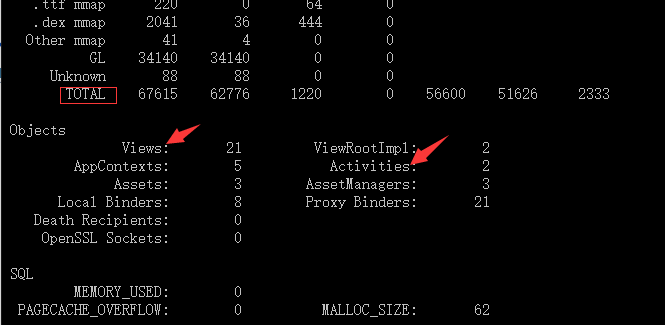

# 内存及性能优化
## 内存泄漏
- 分配策略
    静态分配 ：方法区（静态存储区），编译时已分配好，存在于整个程序运行期间，不需要回收，
    栈式分配 ：栈区，含数据类型、对象的引用，
    堆式分配（动态内存分配）：堆区，
- 内存泄漏：无意识地持有对象引用，使得 持有引用者的生命周期 > 被引用者的生命周期
- 常见内存泄露原因
    1、Static 关键字修饰的成员变量，被 Static 关键字修饰的成员变量的生命周期 = 应用程序的生命周期
    若使被 Static 关键字修饰的成员变量 引用耗费资源过多的实例（如Context），则容易出现该成员变量的生命周期 > 引用实例生命周期的情况，当引用实例需结束生命周期销毁时，会因静态变量的持有而无法被回收，从而出现内存泄露，如需使用Context，尽量使用Application的Context，
    一个典型的例子式单例模式，如果单例持有一个Activity的引用，即使该Activity退出，内存也不会被回收
    2、非静态内部类，非静态内部类默认持有一个外部类的引用，如果把非静态内部类的实例设置为静态，则外部类不会被释放，可以使用静态内部类，或者内部类抽取出来封装成一个单例    
    3、AsyncTask、实现Runnable接口、继承Thread类，若外部类是Activity时，可能一起内存泄漏
    4、资源对象使用后未关闭（如 广播BraodcastReceiver、文件流File、数据库游标Cursor、图片资源Bitmap等）
    ```
        // 对于 广播BraodcastReceiver：注销注册
        unregisterReceiver()

        // 对于 文件流File：关闭流
        InputStream / OutputStream.close()

        // 对于数据库游标cursor：使用后关闭游标
        cursor.close（）

        // 对于 图片资源Bitmap：Android分配给图片的内存只有8M，若1个Bitmap对象占内存较多，当它不再被使用时，应调用recycle()回收此对象的像素所占用的内存；最后再赋为null 
        Bitmap.recycle()；
        Bitmap = null;

        // 对于动画（属性动画）
        // 将动画设置成无限循环播放repeatCount = “infinite”后
        // 在Activity退出时记得停止动画

    ```
    5、Handler对象有Message在排队，则无法释放，进而导致Activity对象不能释放  
    6、WebView销毁时调用`webView.destroy()`也会导致context不能释放，具体原因不太清楚，webView释放
    ```	
      parent.removeAllViews();
      if (webView != null) {
          webView.removeAllViews();
      //  webView.destroy();
          webView.clearCache(false);
          webView.loadUrl("about:blank");
          webView.pauseTimers();//再次启动时需要调用resumeTimers
          webView = null;
      }
    ```
- 内存抖动
尽量避免频繁创建大量、临时的小对象，会导致内存碎片，可能使得系统分配内存时无法整块分配，系统则视为内存不够，导致oom

- Bitmap优化，
    1、使用后释放Bitmap.recycle()、SoftReference
    2、设置多套图片资源，减少Bitmap的拉伸
    3、选择合适的解码方式，ARGB_8888（32位）、ARGB_4444（16位）、ARGB_565（16位）、ALPHA_8（位）, 8位一个字节，以上格式代表每个像素点占多少位，一张图片的内存占用位 xPixel * yPixel * 位数/8/1024 (kb)
    4、设置图片缓存，三级缓存：内存、文件、网络；软引用SoftReference


- 检测方法，页面通过back退出后，用命令'adb shell dumpsys meminfo 应用包名'查看' Activities Views'是否正常，多次进入退出'TOTAL'的值不应变化太大。

参考https://blog.csdn.net/carson_ho/article/details/79407707

## 性能优化
- 性能检查项
  - 启动速度，在onCreate，onResume，onStart等回调中所花费的总时间最好不要超过400ms
  - 界面切换,应用操作时，界面和动画不应有明显卡顿; 设置开发者选项调试GPU过度绘制,操作应用查看gpu是否超线进行初步判断
  - 内存泄露,adb shell dumpsys meminfo 查看
  - onTrimMemory回调，应用响应此回调释放非必须内存；验证可通过命令`adb shell dumpsys gfxinfo 应用包名-cmd trim 5`后，再）用命令`adb shell dumpsys meminfo 应用包名`查看内存大
  - 过度绘制,设置中的GPU过度绘制开关,界面整体呈现浅色，特别复杂的界面，红色区域也不应该超过全屏幕的四分之一
  - lint检查,通过Android Studio中的 AnalyzeInspect Code 对工程代码做静态扫描,最好0 error & 0 warning
  - 连续48小时monkey不应出现闪退，anr问题。关注统计到的崩溃日志
  - 耗电，操作应用后，退出应用，让应用处于后台，一段时间后通过`adb shell dumpsys batterystats`查看电量消耗日志看是否存在异常

- 性能问题一般归结为三类
  - UI卡顿和稳定性    
      卡顿常见原因:
      1) 在UI线程中做轻微耗时操作；
      2) 布局Layout过于复杂，无法在16ms内完成渲染；
      3) 同一时间动画执行的次数过多，导致CPU或GPU负载过重；
      4) View过度绘制，导致某些像素在同一帧时间内被绘制多次，从而使CPU或GPU负载过重；
      5) View频繁的触发measure、layout，导致measure、layout累计耗时过多及整个View频繁的重新渲染；
      6) 内存频繁触发GC过多（同一帧中频繁创建内存），导致暂时阻塞渲染操作；
      7) 冗余资源及逻辑等导致加载和执行缓慢；
      8) 工作线程优先级未设置为Process.THREAD_PRIORITY_BACKGROUND,导致后台线程抢占UI线程cpu时间片，阻塞渲染操作；
      9) ANR；    

      卡顿分析解决的一般步骤:    
      1) 在设置开发者选项调试GPU过度绘制中打开调试，看对应界面是否有过度绘制，如果有先解决掉;可以使用HierarchyView , Tracer for OpenGL ES、lint等工具调试
      2) 检查是否有主线程做了耗时操作，使用严苛模式（StrictMode）进行检测
      3) 检测卡顿view的measure、layout是否耗时过多，可通过Traceview以及systrace来进行分析。
      4) classpath com.jakewharton.hugo:hugo-plugin:1.2.1 调试方法耗时等
  - 内存问题    
      推荐使用Leakcanary + StrictMode + monkey检测 
  - 耗电问题    
      电量优化主要是注意尽量不要影响手机进入休眠，也就是正确申请和释放WakeLock，另外就是不要频繁唤醒手机，主要就是正确使用Alarm。
      使用 [battery-historian](https://github.com/google/battery-historian)分析耗电

- 一些好的代码实践
  1. 节制地使用Service
  2. 当界面不可见时释放内存
  3. 当内存紧张时释放内存
  4. 避免在Bitmap上浪费内存;对大图片，先获取图片的大小信息，根据实际需要展示大小计算inSampleSize，最后decode
  5. 使用优化过的数据集合
  6. 谨慎使用抽象编程
  7. 尽量避免使用依赖注入框架,很多依赖注入框架是基于反射的原理，虽然可以让代码看起来简洁，但是是有碍性能的。
  8. 谨慎使用external libraries，避免可能出现的冲突，例如多种缓存策略
  9. 优化整体性能
  10. 使用ProGuard来剔除不需要的代码
  11. 慎用异常,异常对性能不利,不要再循环中使用 try/catch 语句,应把其放在最外层，使用 System.arraycopy()代替 for 循环复制。
  12. 反射优化，在代码中减少反射调用；对频繁调用的返回值进行Cache；
- 关于性能优化的一些工具及方法
  - 启动时间
  `adb shell am start -W [packageName]/[packageName.XxxActivity]`

  - 通过AndroidStudio Profiler工具使用分析方法耗时及cpu占用
          Debug.startMethodTracing("/data/data/com.cwj10.aas.example/example.trace");
          Debug.stopMethodTracing();
  - 用户体验优化
      1、启动页优化，为启动Activity设置theme，设置android:windowBackground背景图片
      2、
  - 绘制优化：
      1、降低onDraw的复杂度
      2、避免过度绘制（控件与布局之间的背景重复、Window背景、Layout，使用include 、merge、viewStup标签）

  - 安装包体积
      1、能用shape就绝不用图片
      2、压缩图片，如TinyPng
      3、使用webp图片，相同的图片质量下，体积更小。
      4、去除不用的so文件，目前市面上绝大部分的CPU架构都是 ARMv7/ARMv8，所以可以在gradle中加入配置，只保留v7,v8。
      ```
          defaultConfig {
          ...
          ndk {
              abiFilters 'armeabi-v7a', 'arm64-v8a' 
          }
      }
      ```
      5、资源动态加载，如emoji、换肤等
      6、移除无用资源，菜单->Analyze-> “run inspaction by Name ...”->输入“Unused Resources”。
      7、代码混淆
      ```
          buildTypes {
          release {
              buildConfigField "boolean", "LOG_DEBUG", "false" //不显示log
              minifyEnabled true   //开启混淆
              shrinkResources true  //移除无用资源
              zipAlignEnabled true //Zipalign优化
              proguardFiles getDefaultProguardFile('proguard-android.txt'), 'proguard-rules.pro'
              signingConfig signingConfigs.config
              }
          }
        }
      ```
  - strictmode
  - onTrimMemory处理
  - 优化后的数据集合
  - wakeLock处理
  - adb shell meminfo等命令
  - mat
  - systrace
  - traceview
  - hierarchyview
  - ddms
  - lint
  - proGuard
  - monkey
  - leakcanary
  - debuglog（com.jakewharton.hugo:hugo-plugin）
  - gpu过度绘制

- 参考资料
[https://developer.android.com/training/articles/memory.html#YourApp](https://developer.android.com/training/articles/memory.html#YourApp)
